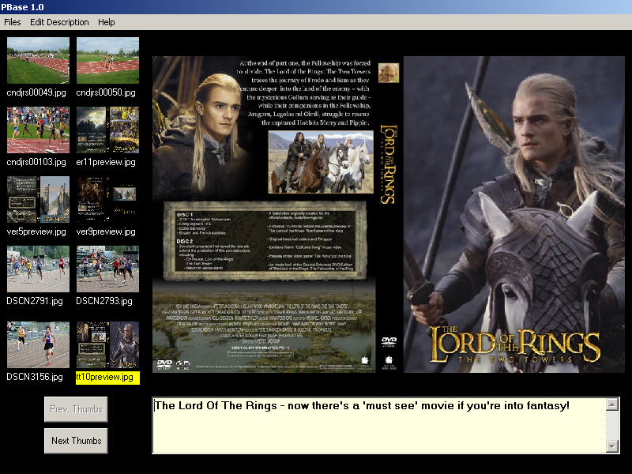



## PBase \(Picture Base\)

### Description

Displays thumbs of all image files in a given folder, a larger view and a description of the selected thumb.
 
### More Info
 

             |
---                |---
**Submitted On**   |2003-12-22 20:37:32
**By**             |[Peter Raddatz](https://github.com/Planet-Source-Code/PSCIndex/blob/master/ByAuthor/peter-raddatz.md)
**Level**          |Intermediate
**User Rating**    |4.8 (19 globes from 4 users)
**Compatibility**  |VB 6\.0
**Category**       |[Complete Applications](https://github.com/Planet-Source-Code/PSCIndex/blob/master/ByCategory/complete-applications__1-27.md)
**World**          |[Visual Basic](https://github.com/Planet-Source-Code/PSCIndex/blob/master/ByWorld/visual-basic.md)
**Archive File**   |[PBase\_\(Pic16861612222003\.zip](https://github.com/Planet-Source-Code/peter-raddatz-pbase-picture-base__1-50576/archive/master.zip)

